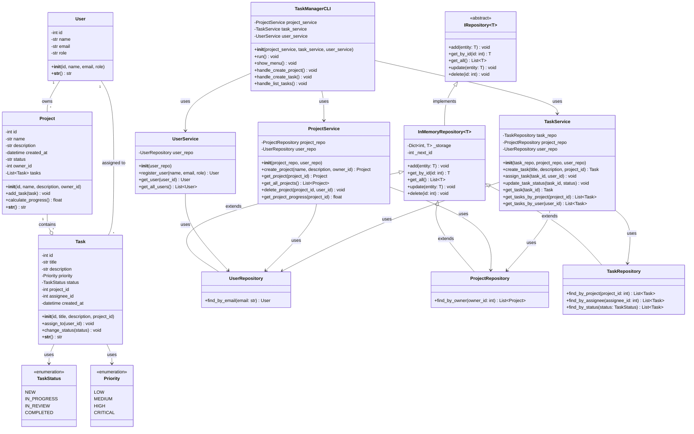

# UML-диаграмма классов

## Диаграмма классов системы управления задачами

## Описание основных классов

### Domain Layer (Модели)

#### User
Представляет пользователя системы с уникальным ID, именем, email и ролью.

#### Project
Контейнер для задач, содержит метаданные проекта и методы для управления задачами.

#### Task
Основная единица работы, содержит всю информацию о задаче.

#### TaskStatus и Priority
Перечисления для типобезопасного управления статусами и приоритетами.

### Data Access Layer (Репозитории)

#### IRepository<T>
Абстрактный базовый класс, определяющий общий интерфейс для CRUD-операций.

#### InMemoryRepository<T>
Конкретная реализация, хранящая данные в памяти через словарь.

#### UserRepository, ProjectRepository, TaskRepository
Специализированные репозитории с дополнительными методами для поиска и фильтрации.

### Business Logic Layer (Сервисы)

#### UserService
Управляет пользователями: регистрация, получение, валидация.

#### ProjectService
Реализует бизнес-логику для проектов: создание, удаление, расчет прогресса.

#### TaskService
Обеспечивает всю логику работы с задачами: создание, назначение, изменение статуса.

### Presentation Layer

#### TaskManagerCLI
Консольный интерфейс, координирующий взаимодействие пользователя с сервисами.

## Основные взаимосвязи

- **Ассоциация**: User связан с Task и Project
- **Композиция**: Project содержит Task
- **Наследование**: Специализированные репозитории наследуются от InMemoryRepository
- **Зависимость**: Сервисы зависят от репозиториев (через Dependency Injection)
