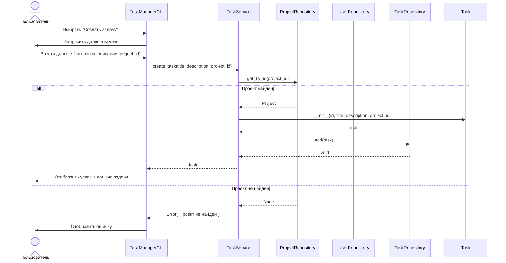
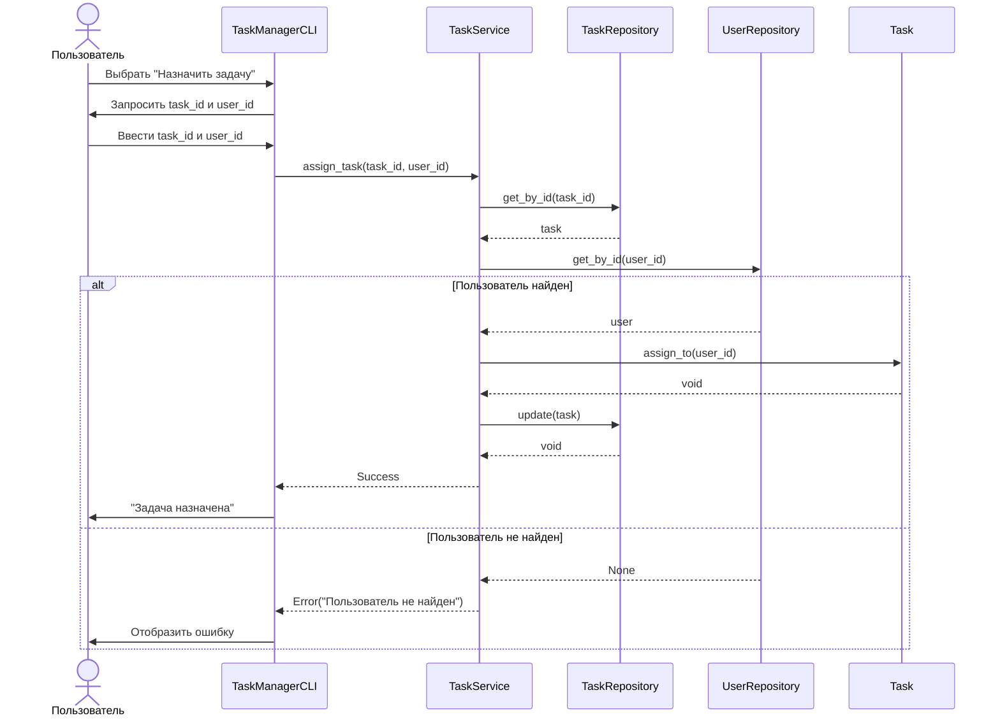
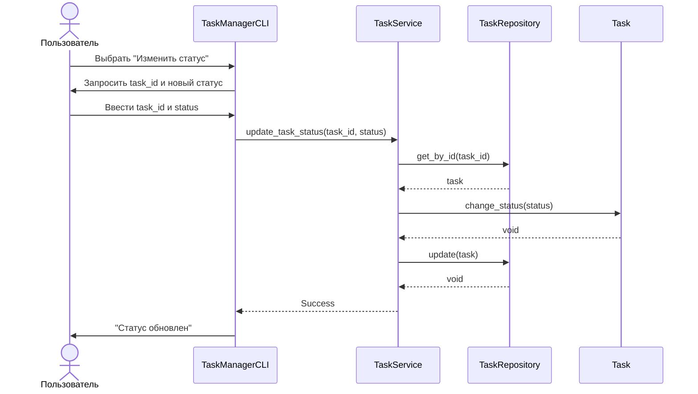
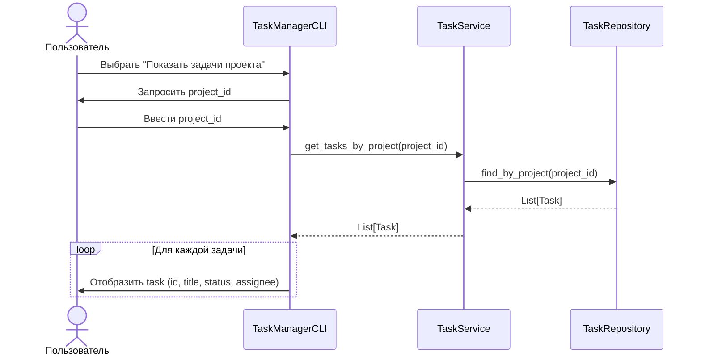

# UML-диаграмма последовательностей

## Сценарий 1: Создание новой задачи

## Сценарий 2: Назначение задачи исполнителю

## Сценарий 3: Изменение статуса задачи

## Сценарий 4: Просмотр задач проекта с фильтрацией

## Описание взаимодействий

### Основные участники:
- **Пользователь** - инициирует действия
- **CLI** - обрабатывает ввод/вывод
- **Service** - реализует бизнес-логику
- **Repository** - управляет данными
- **Модель** - представляет данные

### Шаблон взаимодействия:
1. Пользователь инициирует действие через CLI
2. CLI запрашивает необходимые данные
3. CLI вызывает метод сервиса
4. Сервис валидирует и обрабатывает запрос
5. Сервис взаимодействует с репозиториями
6. Результат возвращается пользователю через CLI

### Обработка ошибок:
- Валидация входных данных в сервисах
- Проверка существования связанных сущностей
- Возврат понятных сообщений об ошибках
- Отображение ошибок пользователю через CLI
